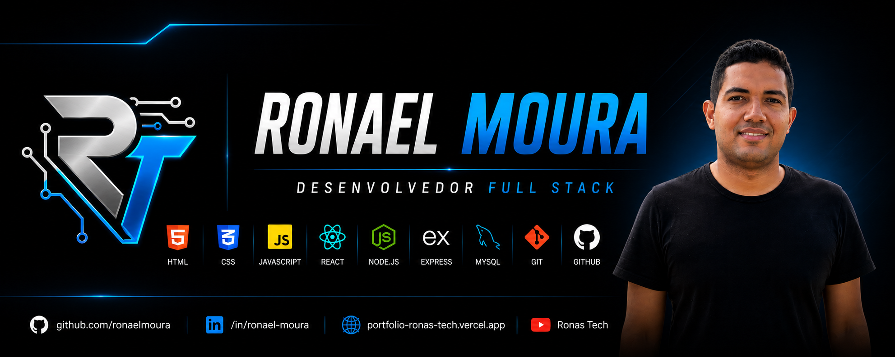

<!-- ========================= BANNER ========================= -->

  

  

<h1 align="center">Opa 👋, eu sou Ronael Moura</h1>

<h3 align="center">💻 Desenvolvedor Full Stack</h3>

Transformando ideias em soluções reais através da tecnologia.

  
  
  
  

---

# 👨‍💻 Sobre mim

Sou **Desenvolvedor Full Stack**, formado pelo **SENAI** no curso de **Programador Full Stack**.

Tenho experiência com desenvolvimento web, APIs REST, banco de dados MySQL, Git e GitHub, além de atuação em **Suporte em TI**, manutenção de computadores e atendimento a usuários.

Atualmente estou desenvolvendo o **Ronas Desk**, um sistema completo para gerenciamento de clientes e chamados, utilizando boas práticas de arquitetura de software e desenvolvimento Full Stack.

Meu objetivo é crescer profissionalmente, contribuir com projetos desafiadores e criar soluções modernas que gerem impacto real.

---

# 🚀 Tecnologias

  

---

# 🚀 Projetos em Destaque

## 💼 Ronas Desk

Sistema Full Stack para gerenciamento de clientes e chamados.

**Tecnologias:** React, Node.js, Express, MySQL, Git e GitHub.  
**Status:** Em desenvolvimento.

## 🌐 Ronas Tech

Site institucional da Ronas Tech, empresa focada em desenvolvimento de sites, sistemas web, APIs, dashboards e soluções digitais.

**Tecnologias:** React, Vite, JavaScript e CSS Modules.

## 👨‍💻 Portfólio Profissional

Portfólio com informações profissionais, projetos, tecnologias e formas de contato.

---

# 📈 Contribuições

  

---

# 🏆 Certificações

🎓 Programador Full Stack — SENAI  
📚 670 horas  
💻 Técnico em Suporte em TI  
📊 Pacote Office Completo

---

# 🎯 Atualmente

- 🚀 Desenvolvendo o Ronas Desk
- 📖 Aprimorando React
- ⚡ Estudando Arquitetura de Software
- 💼 Buscando oportunidade como Desenvolvedor Full Stack
- 🎥 Criando conteúdo para o canal Ronas Tech

---

# 📫 Contato

📍 Tianguá — Ceará — Brasil  
📧 ronaelmoura240@gmail.com  
💼 [LinkedIn](https://www.linkedin.com/in/ronael-moura)  
🌐 [Site institucional](https://ronas-tech-site.vercel.app/)  
🐙 [GitHub](https://github.com/ronaelmoura)

---

  ⭐ Obrigado por visitar meu perfil! 
  Se gostou dos meus projetos, deixe uma ⭐ nos repositórios.

---

  <b>Transformando ideias em soluções reais através da tecnologia.</b>

