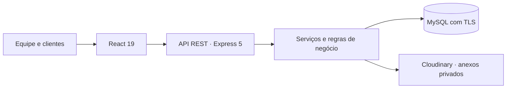

<p align="center">
  
</p>

<p align="center">
  <a href="https://ronaelmoura.github.io/"></a>
  <a href="https://www.linkedin.com/in/ronael-moura"></a>
  <a href="https://www.ronastech.com.br/"></a>
</p>

<p align="center">
  
  
  
</p>

<br />

```text
// Minha forma de trabalhar
entender o problema → desenhar a solução → construir → testar → publicar → evoluir
```

## ⚡ O que eu entrego

Sou Desenvolvedor Full Stack formado pelo SENAI (670 horas) e fundador da Ronas Tech. Construo aplicações completas com React, Node.js, Express e MySQL — não apenas interfaces: entrego APIs, regras de negócio, banco de dados, autenticação, testes e deploy.

Minha experiência em suporte de TI me ensinou a investigar antes de programar, comunicar com clareza e assumir responsabilidade pela solução até ela funcionar para quem precisa usar.

<table>
  <tr>
    <td width="50%" valign="top">
      <h3>🧠 Pensamento de produto</h3>
      <p>Transformo necessidades operacionais em fluxos simples, rastreáveis e úteis para o usuário.</p>
    </td>
    <td width="50%" valign="top">
      <h3>🛠️ Engenharia prática</h3>
      <p>Interface, API, dados, segurança, testes e deploy conectados em uma entrega real.</p>
    </td>
  </tr>
</table>

## 🧭 Meu painel de construção

```javascript
const ronael = {
  foco: 'transformar problemas operacionais em software útil',
  entrego: ['interface', 'API REST', 'regras de negócio', 'dados', 'testes', 'deploy'],
  agora: 'evoluindo um portfólio com frontend, backend e produto',
  próximoDesafio: 'contribuir em um time que constrói produtos com impacto real',
}
```

## 🚀 Case principal — Ronas Desk v1.0

<p align="center">
  <a href="https://ronas-desk.onrender.com/"></a>
</p>

Plataforma Full Stack de Help Desk publicada em produção. Criei para simular a operação de uma equipe de suporte com segurança, rastreabilidade e indicadores reais de atendimento.

<p align="center">
  <a href="https://ronas-desk.onrender.com/"></a>
  <a href="https://github.com/ronaelmoura/ronas-desk"></a>
</p>

| Produto | Engenharia | Qualidade |
| --- | --- | --- |
| Clientes, chamados, SLA, relatórios, auditoria, anexos e Portal do Cliente | React 19, Express 5, MySQL, JWT, Docker, Nginx, Render, Aiven TLS e Cloudinary | **122 testes automatizados**, Helmet, rate limit e permissões por perfil |

<p align="center">
  <a href="https://github.com/ronaelmoura/ronas-desk/actions/workflows/ci.yml"></a>
</p>

### Arquitetura que eu construí


```mermaid
flowchart LR
  U["Equipe e clientes"] --> F["React 19"]
  F --> A["API REST · Express 5"]
  A --> S["Serviços e regras de negócio"]
  S --> D[("MySQL com TLS")]
  S --> C["Cloudinary · anexos privados"]
```

## 🧰 O que eu domino, e pra que serve

| Camada | Domino | Uso na prática |
| --- | --- | --- |
| 🖼️ Interface | React 19, TypeScript, Vite | Dashboards e produtos com estado complexo, UI responsiva e modo escuro |
| ⚙️ Serviços | Node.js, Express 5, REST, JWT | APIs com regras de negócio, autenticação e autorização por perfil |
| 🗄️ Dados | MySQL, transações, Zod | Consistência transacional e integridade em operações concorrentes |
| ✅ Qualidade | Vitest, CI no GitHub Actions | Testes automatizados e build validado antes de qualquer deploy |
| 🚀 Entrega | Docker, Nginx, Render, Cloudflare Workers | Deploy containerizado, observável e em produção real |


## 📊 Atividade & métricas

<p align="center">
  
  
</p>

<p align="center">
  
</p>

<picture>
  <source media="(prefers-color-scheme: dark)" srcset="https://raw.githubusercontent.com/ronaelmoura/ronaelmoura/output/github-contribution-grid-snake-dark.svg" />
  
</picture>

## 📌 Projetos que representam meu trabalho

| | Projeto | Por que vale abrir |
| :---: | --- | --- |
| 🖥️ | [**Ronas Desk**](https://github.com/ronaelmoura/ronas-desk) · [Demo](https://ronas-desk.onrender.com/) | Produto Full Stack em produção: regras de negócio, segurança, testes e deploy. |
| 💰 | [**Nexo — Dashboard Financeiro**](https://github.com/ronaelmoura/nexo-dashboard-financeiro) · [Demo](https://ronaelmoura.github.io/nexo-dashboard-financeiro/) | React, gráficos, filtros, modo escuro e experiência responsiva aplicados a finanças pessoais. |
| 📦 | [**StockFlow API**](https://github.com/ronaelmoura/stockflow-api) [](https://github.com/ronaelmoura/stockflow-api/actions/workflows/ci.yml) | API de estoque e pedidos com Node.js, Express, MySQL, autenticação, transações e documentação OpenAPI. |
| ❄️ | [**ClimaZen**](https://github.com/ronaelmoura/climazen-landing-page) · [Demo](https://ronaelmoura.github.io/climazen-landing-page/) | Landing page comercial com design responsivo, simulador de economia, formulário e foco em conversão. |
| 🧩 | [**Portfólio**](https://github.com/ronaelmoura/ronaelmoura.github.io) · [Demo](https://ronaelmoura.github.io/) | Site autoral com storytelling, laboratório interativo de engenharia e cases documentados. |

<p align="center">
  <a href="https://www.ronastech.com.br/#projetos"></a>
</p>

## 🤝 Vamos construir algo que importa

Se a sua empresa procura alguém com disposição para entender o problema, aprender rápido e entregar software que funciona de verdade, vamos conversar.

<p align="center">
  <a href="mailto:ronaelmoura240@gmail.com"></a>
  <a href="https://www.linkedin.com/in/ronael-moura"></a>
</p>


