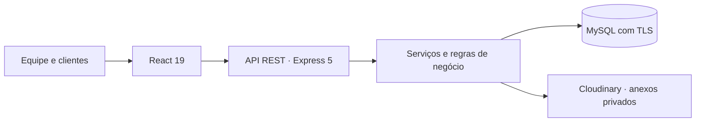

<p align="center">
  <a href="https://ronaelmoura.github.io/"></a>
  <a href="https://ronas-desk.onrender.com/"></a>
  <a href="https://www.ronastech.com.br/"></a>
  <a href="https://www.linkedin.com/in/ronael-moura"></a>
  <a href="https://raw.githubusercontent.com/ronaelmoura/ronaelmoura/main/assets/curriculo-ronael-moura.pdf"></a>
</p>

<p align="center">
  
</p>

## Sobre

Desenvolvedor Full Stack formado pelo SENAI (670 horas) e fundador da Ronas Tech. Construo aplicações completas com React, Node.js, Express e MySQL — não só a interface: API, regras de negócio, banco, autenticação, testes e deploy.

Minha experiência em suporte de TI me ensinou a reproduzir o bug antes de sair reescrevendo tudo, comunicar com clareza e assumir a solução até ela funcionar de verdade — não só no `localhost`.

```javascript
const ronael = {
  stack: ['React', 'Node.js', 'Express', 'MySQL'],
  entrego: ['interface', 'API REST', 'regras de negócio', 'dados', 'testes', 'deploy'],
  agora: 'construindo produto de verdade na Ronas Tech',
  buscando: 'um time que constrói coisas com impacto real',
  bugsConhecidos: 0, // que eu saiba
}
```

## Stack

| Camada | Ferramentas | Uso na prática |
| --- | --- | --- |
| Interface | React 19, Vite, TypeScript | Dashboards e produtos com estado complexo, UI responsiva e modo escuro |
| Serviços | Node.js, Express 5, REST, JWT | APIs com regras de negócio, autenticação e autorização por perfil |
| Dados | MySQL, transações, Zod | Consistência transacional e integridade em operações concorrentes |
| Qualidade | Vitest, GitHub Actions | Testes automatizados e build validado antes de qualquer deploy |
| Entrega | Docker, Nginx, Render, Cloudflare Workers | Deploy containerizado, observável e em produção real |

## Ronas Desk

Plataforma Full Stack de Help Desk publicada em produção — meu case principal. Criei para simular a operação de uma equipe de suporte com segurança, rastreabilidade e indicadores reais de atendimento.


<p align="center"><sub>Simulação ilustrativa do fluxo de deploy — não é uma gravação de tela real.</sub></p>

| Funcionalidades | Engenharia | Qualidade |
| --- | --- | --- |
| Clientes, chamados, SLA, relatórios, auditoria, anexos e Portal do Cliente | React 19, Express 5, MySQL, JWT, Docker, Nginx, Render, Aiven TLS e Cloudinary | **122 testes automatizados**, Helmet, rate limit e permissões por perfil |


```mermaid
flowchart LR
  U["Equipe e clientes"] --> F["React 19"]
  F --> A["API REST · Express 5"]
  A --> S["Serviços e regras de negócio"]
  S --> D[("MySQL com TLS")]
  S --> C["Cloudinary · anexos privados"]
```

<p align="center">
  <a href="https://ronas-desk.onrender.com/"></a>
  <a href="https://github.com/ronaelmoura/ronas-desk"></a>
  <a href="https://github.com/ronaelmoura/ronas-desk/actions/workflows/ci.yml"></a>
</p>

## Projetos

| | Projeto | Por que vale abrir |
| :---: | --- | --- |
| 🖥️ | [**Ronas Desk**](https://github.com/ronaelmoura/ronas-desk) · [demo](https://ronas-desk.onrender.com/) | Produto Full Stack em produção: regras de negócio, segurança, testes e deploy. |
| 💰 | [**Nexo — Dashboard Financeiro**](https://github.com/ronaelmoura/nexo-dashboard-financeiro) · [demo](https://ronaelmoura.github.io/nexo-dashboard-financeiro/) | React e TypeScript com gráficos, filtros, modo escuro e layout responsivo. |
| 📦 | [**StockFlow API**](https://github.com/ronaelmoura/stockflow-api) [](https://github.com/ronaelmoura/stockflow-api/actions/workflows/ci.yml) | API de estoque e pedidos com Node.js, Express, MySQL, transações e OpenAPI. |
| ❄️ | [**ClimaZen**](https://github.com/ronaelmoura/climazen-landing-page) · [demo](https://ronaelmoura.github.io/climazen-landing-page/) | Landing page comercial responsiva com simulador de economia e foco em conversão. |
| 🧩 | [**Portfólio**](https://github.com/ronaelmoura/ronaelmoura.github.io) · [demo](https://ronaelmoura.github.io/) | Site autoral com storytelling, laboratório interativo e cases documentados. |

## Atividade

<p align="center">
  
  
</p>

<p align="center">
  
</p>


## Contato

Se você procura alguém com disposição para entender o problema, aprender rápido e entregar software que funciona de verdade — e não só no ambiente de dev —, vamos conversar.

<p align="center">
  <a href="mailto:ronaelmoura240@gmail.com"></a>
  <a href="https://www.linkedin.com/in/ronael-moura"></a>
</p>


