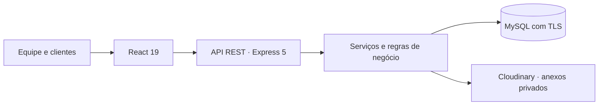

<picture>
  <source media="(prefers-color-scheme: light)" srcset="https://raw.githubusercontent.com/ronaelmoura/ronaelmoura/main/assets/ronas-motion-light.svg" />
  
</picture>

<p align="center"><sub>A cena acompanha a hora em São Paulo e mostra meu último commit de verdade. Regenerada de hora em hora.</sub></p>

<p align="center">
  <a href="https://ronaelmoura.github.io/"></a>
  <a href="https://ronas-desk.onrender.com/"></a>
  <a href="https://www.ronastech.com.br/"></a>
  <a href="https://www.linkedin.com/in/ronael-moura"></a>
  <a href="https://raw.githubusercontent.com/ronaelmoura/ronaelmoura/main/assets/curriculo-ronael-moura.pdf"></a>
</p>

<p align="center">
  
</p>

## Sobre

Desenvolvedor Full Stack e fundador da Ronas Tech. Entrego a aplicação inteira — interface, API, regras de negócio, banco, autenticação, testes e deploy — e assumo a solução até ela funcionar de verdade, não só no `localhost`.

```javascript
const ronael = {
  agora: 'construindo produto de verdade na Ronas Tech',
  buscando: 'um time que constrói coisas com impacto real',
  bugsConhecidos: 0, // que eu saiba
}
```

<details>
<summary><code>$ cat trajetoria.txt</code></summary>

<br />

Comecei em suporte de TI, atendendo quem estava com o problema na frente e sem paciência para jargão. Isso me ensinou três coisas que carrego para o código:

- **Reproduzir antes de opinar.** Metade dos bugs "impossíveis" some quando você olha o log de verdade.
- **Escrever para quem vai ler depois.** Chamado, commit e README têm o mesmo dono: a próxima pessoa — que às vezes sou eu daqui a seis meses.
- **A entrega termina no usuário, não no merge.** Deploy que ninguém consegue usar é rascunho caro.

Hoje toco a Ronas Tech, onde levo produto do problema até a produção.

</details>

## Stack

| Camada | Ferramentas |
| --- | --- |
| Interface | React 19, Vite, TypeScript |
| Serviços | Node.js, Express 5, REST, JWT |
| Dados | MySQL, transações, Zod |
| Qualidade | Vitest, GitHub Actions |
| Entrega | Docker, Nginx, Render, Cloudflare Workers |

## Ronas Desk

Plataforma Full Stack de Help Desk publicada em produção — meu case principal. Criei para simular a operação de uma equipe de suporte com segurança, rastreabilidade e indicadores reais de atendimento.


<p align="center"><sub>Simulação ilustrativa do fluxo de deploy — não é uma gravação de tela real.</sub></p>

| Funcionalidades | Engenharia | Qualidade |
| --- | --- | --- |
| Clientes, chamados, SLA, relatórios, auditoria, anexos e Portal do Cliente | React 19, Express 5, MySQL, JWT, Docker, Nginx, Render, Aiven TLS e Cloudinary | **122 testes automatizados**, Helmet, rate limit e permissões por perfil |

<details>
<summary><code>$ ronas-desk --arquitetura</code></summary>

<br />


```mermaid
flowchart LR
  U["Equipe e clientes"] --> F["React 19"]
  F --> A["API REST · Express 5"]
  A --> S["Serviços e regras de negócio"]
  S --> D[("MySQL com TLS")]
  S --> C["Cloudinary · anexos privados"]
```

O front nunca fala com o banco. Toda regra de negócio vive na camada de serviços, que é onde ficam as transações — assim dois atendentes mexendo no mesmo chamado não se atropelam. Anexos não passam pelo servidor de aplicação: vão direto para o Cloudinary com acesso privado.

</details>

<p align="center">
  <a href="https://ronas-desk.onrender.com/"></a>
  <a href="https://github.com/ronaelmoura/ronas-desk"></a>
  <a href="https://github.com/ronaelmoura/ronas-desk/actions/workflows/ci.yml"></a>
</p>

## Projetos

| | Projeto | Por que vale abrir |
| :---: | --- | --- |
| 🖥️ | [**Ronas Desk**](https://github.com/ronaelmoura/ronas-desk) · [demo](https://ronas-desk.onrender.com/) | Produto Full Stack em produção: regras de negócio, segurança, testes e deploy. |
| 💰 | [**Nexo — Dashboard Financeiro**](https://github.com/ronaelmoura/nexo-dashboard-financeiro) · [demo](https://ronaelmoura.github.io/nexo-dashboard-financeiro/) | React e TypeScript com gráficos, filtros, modo escuro e layout responsivo. |
| 📦 | [**StockFlow API**](https://github.com/ronaelmoura/stockflow-api) [](https://github.com/ronaelmoura/stockflow-api/actions/workflows/ci.yml) | API de estoque e pedidos com Node.js, Express, MySQL, transações e OpenAPI. |
| ❄️ | [**ClimaZen**](https://github.com/ronaelmoura/climazen-landing-page) · [demo](https://ronaelmoura.github.io/climazen-landing-page/) | Landing page comercial responsiva com simulador de economia e foco em conversão. |
| 🧩 | [**Portfólio**](https://github.com/ronaelmoura/ronaelmoura.github.io) · [demo](https://ronaelmoura.github.io/) | Site autoral com storytelling, laboratório interativo e cases documentados. |

## Atividade

<p align="center">
  
  
</p>

<picture>
  <source media="(prefers-color-scheme: light)" srcset="https://raw.githubusercontent.com/ronaelmoura/ronaelmoura/main/assets/black-pearl-sailing-light.svg" />
  
</picture>

<p align="center"><sub>O mar não é enfeite: a altura de cada onda é o total de contribuições daquela semana, e o navio percorre essa curva.</sub></p>

<details>
<summary><code>$ como-a-arte-funciona --verbose</code></summary>

<br />

As duas cenas deste perfil são SVG que eu gero, não widget de terceiro — o que significa que nenhum serviço fora do ar derruba a página. Um workflow roda de hora em hora e redesenha tudo:

| Peça | De onde vem |
| --- | --- |
| Luz da cena | Hora atual em São Paulo — madrugada, manhã, tarde e noite têm paletas diferentes |
| Chuva e relâmpago | Aparecem no fim da tarde e na madrugada |
| Linha do último commit | Feed público de eventos, com a mensagem buscada pelo SHA |
| Rótulo do monitor | Última execução do CI do Ronas Desk |
| Altura das ondas | Contribuições por semana no último ano |
| Versão clara/escura | Duas artes geradas no mesmo passo, servidas por `<picture>` |

A animação é SMIL puro dentro do SVG, inclusive o efeito de máquina de escrever — um `clipPath` que cresce em passos discretos, uma letra por vez. O navio não é animado à mão: ele percorre a curva das contribuições com `animateMotion`, então sobe de verdade nas semanas cheias.

O código está em [`scripts/`](https://github.com/ronaelmoura/ronaelmoura/tree/main/scripts) — sem dependências, só Node.

</details>

## Contato

Se você procura alguém com disposição para entender o problema, aprender rápido e entregar software que funciona de verdade — e não só no ambiente de dev —, vamos conversar.

<p align="center">
  <a href="mailto:ronaelmoura240@gmail.com"></a>
  <a href="https://www.linkedin.com/in/ronael-moura"></a>
</p>


